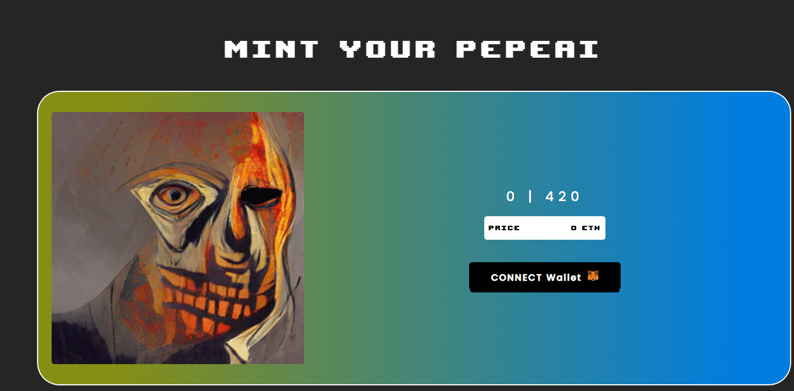

20 1/1 独特的 Pepe 艺术作品由人类使用 AI 神经网络策划  0.005 ea - 每 tx 3

经过pepai-部署从 AI 神经网络创建的 420 1/1 Pepes

什么是  pepeai  ？
 pepeai  是一个 NFT（非同质代币）集合。存储在区块链上的数字艺术品集合。
存在多少 pepai 代币？
总共有 6 个  pepeai  NFT。目前 2 位所有者的钱包中至少有一个  pepeai  NTF。
最近卖出了多少pepai？
过去 30 天内售出 0 个 pepeai NFT。

