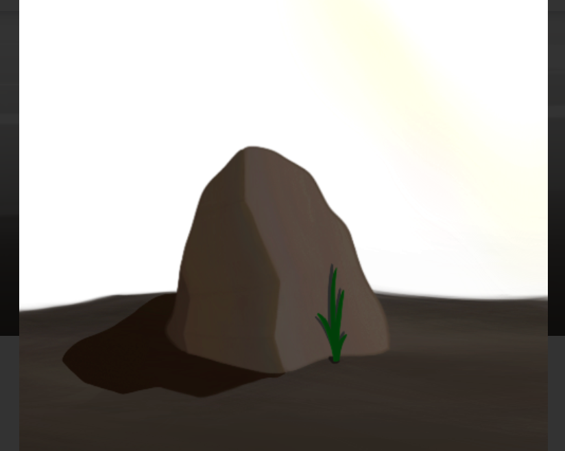

项目网站、社交联系方式、项目介绍内容详见：

我们只是来 phlip (flip) Pet Rocks。

“翻转”动词

1. 突然快速动作翻身。“宠物 Phrocks 翻转了 Pet Rocks 然后爆炸了”

   宠物佛罗克系列绝对是你见过最震撼的NFT！宠物佛罗克系列是一个 NFT（不可替代代币）系列。存储在区块链上的数字艺术品集合。

   总共有 800 个 Pet Phrock Collection NFT。目前，246 位所有者的钱包中至少有一个 Pet Phrock Collection NTF。

