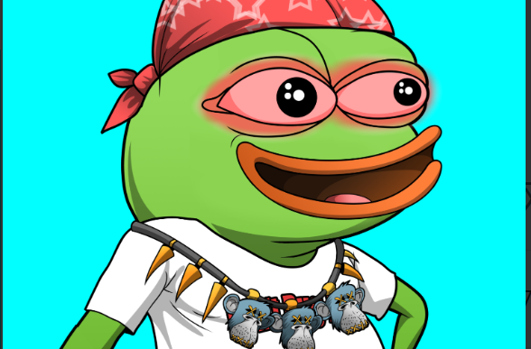

项目网站、社交联系方式、项目介绍内容详见

重新想象互联网上最臭名昭著的青蛙，Pepe Unlimited 青蛙只是为了被人们用作他们的化身，以在互联网上并最终在元宇宙中保持伪匿名。

Pepe Unlimited frogs 是以太坊区块链上 3,334 个随机生成的 NFT 的集合。

免费铸造一只 Pepe Unlimited 青蛙，并在创作 YouTube 视频、Twitter 上的狗屎帖子或 Instagram 上的巨魔名人时，将自己的个性置于其背后。无尽的机会等待着！

