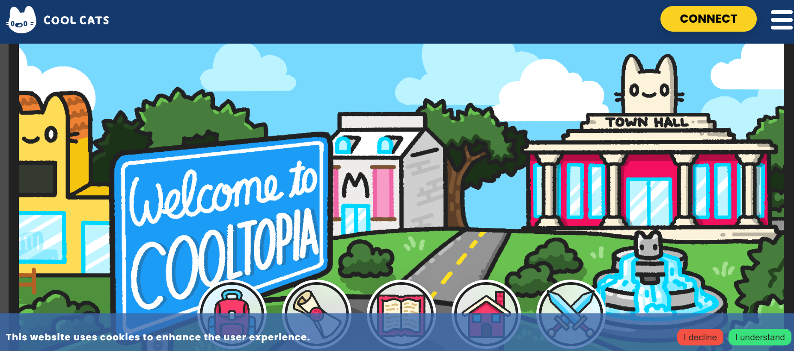

项目网站、社交联系方式、项目介绍内容详见：

作为 Cool Cats 品牌的 NFT 产品，Pets 是 19,999 个 NFT 的集合，这些 NFT 是基于项目交互程序生成的。所有宠物都从蛋开始，然后演变成最终形式，代表四种元素之一：草、火、水或空气。用户可以通过我们在coolcatsnft.com 上的游戏化体验进化他们的宠物[——](https://coolcatsnft.com/)您的最终宠物是1700 万种可能结果之一！要了解有关宠物、彩蛋和 Cooltopia 世界的更多信息，

