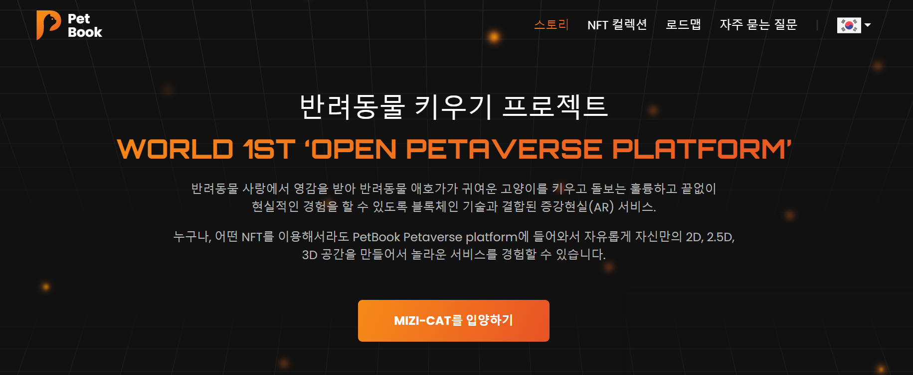

项目网站、社交联系方式、项目介绍内容详见：

受到对动物的热爱的启发，我们带来了 PetBook——一个使用增强现实 (AR) 技术与区块链相结合的项目，将您带入最真实体验的全新世界，享受养育、培育和玩无尽选择的美好时光MiZi-Cat 外观和配件。我们超大规模的 Petaverse 由一支优秀的团队组成，旨在为您带来千载难逢的机会参与宠物爱好者的世界，扩大圈子扩大宠物社区，促进动物护理。

查看我们关于 PetBook 的最新更新

