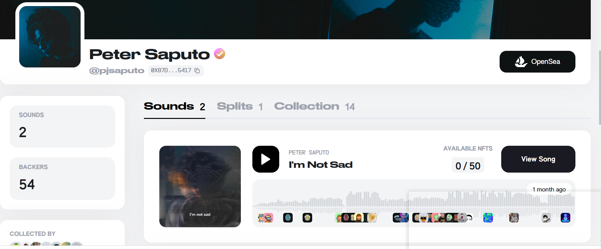

项目网站、社交联系方式、项目介绍内容详见：

Peter Saputo 是一个 NFT（非同质代币）集合。存储在区块链上的数字艺术品集合。

总共有 75 个 Peter Saputo NFT。目前，54 位车主的钱包中至少有一个 Peter Saputo NTF。

Peter Saputo NFT 在过去 7 天内售出 1 次。Peter Saputo 的总销售额为 384.23 美元。一个 Peter Saputo NFT 的平均价格为 384.2 美元。有 54 位 Peter Saputo 所有者，总共拥有 75 个代币。

