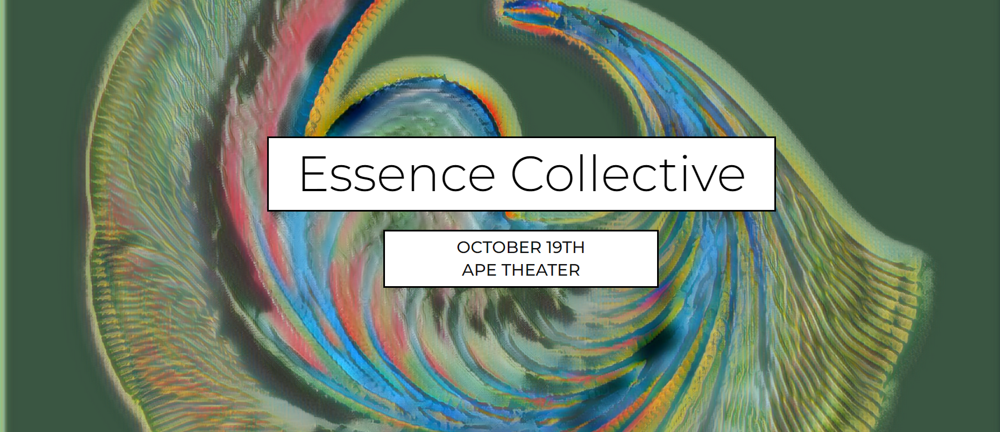

项目网站、社交联系方式、项目介绍内容详见：

Petri 代表了机械产生的生命形式的早期阶段。基于自然发生的数学形式，如斐波那契数列，Petri 重新构想了有机生长和人工生长之间的关系，同时模糊了两者之间的界限。Vie 系列的创世系列通过 Essence Collective 分发。

一只猿在无限长的时间里随意敲击键 ... 不可避免地会像莎士比亚本人
一样写作 。Dag 的算法使用 AI 来讽刺“天才”，将人类的创造力降低为单纯的数字游戏。 Dag 的代码为无限猴子定理提供了后现代主义的转折。

