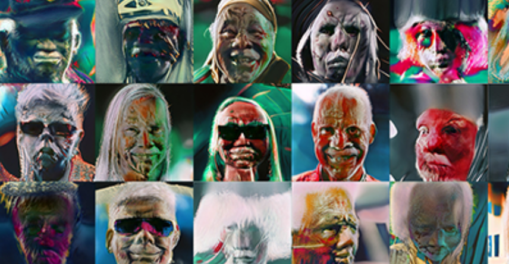

项目网站、社交联系方式、项目介绍内容详见：

PEYOTES 是 4.000 个独特的 AI 生成的迷幻肖像，生活在多边形区块链上，元数据存储在 IPFS 上。

持有 PEYOTES，赚取 $TRYBE。

100% 的预售收入 + 100% 的二级销售收入将归[TrybeDAO](https://trybedao.com/)会员所有。

每个 PEYOTE 都是加入 TrybeDAO 社区、活动、治理和奖励的通行证。

每个会员将根据持有的 PEYOTES 数量获得[$TRYBE 代](https://trybedao.com/trybetoken/)币的份额。

