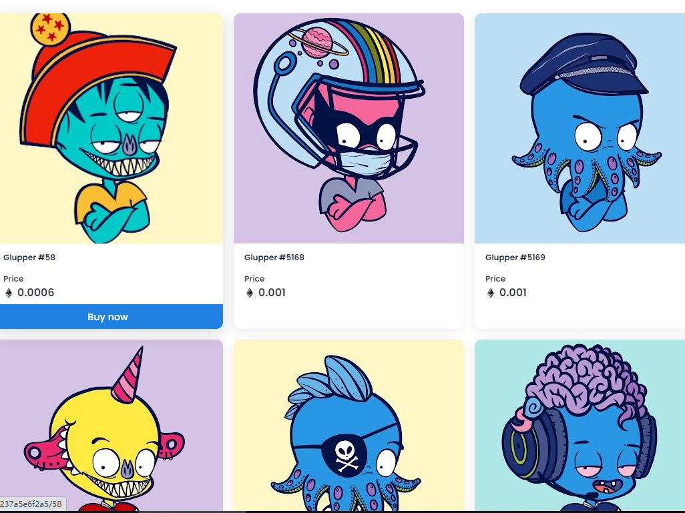

##### ▶ 什么是 GluppersNFT？

GluppersNFT 是一个 NFT（非同质代币）集合。存储在区块链上的数字艺术品集合。

##### ▶ GluppersNFT 代币有多少？

总共有 5,555 个 GluppersNFT NFT。目前，1,186 位所有者的钱包中至少有一个 GluppersNFT NTF。

##### ▶ GluppersNFT 最昂贵的交易是什么？

出售的最昂贵的 GluppersNFT NFT 是 Glupper #2734。它于 2022-07-01（大约 2 个月前）以 11 美元的价格售出。

##### ▶ 最近卖出了多少 GluppersNFT？

过去 30 天内售出了 117 个 GluppersNFT NFT。

##### ▶ GluppersNFT 需要多少钱？

在过去 30 天里，GluppersNFT 最便宜的 NFT 销售额低于 1 美元，最高销售额超过 5 美元。过去 30 天 GluppersNFT NFT 的中位价格为 2 美元。

