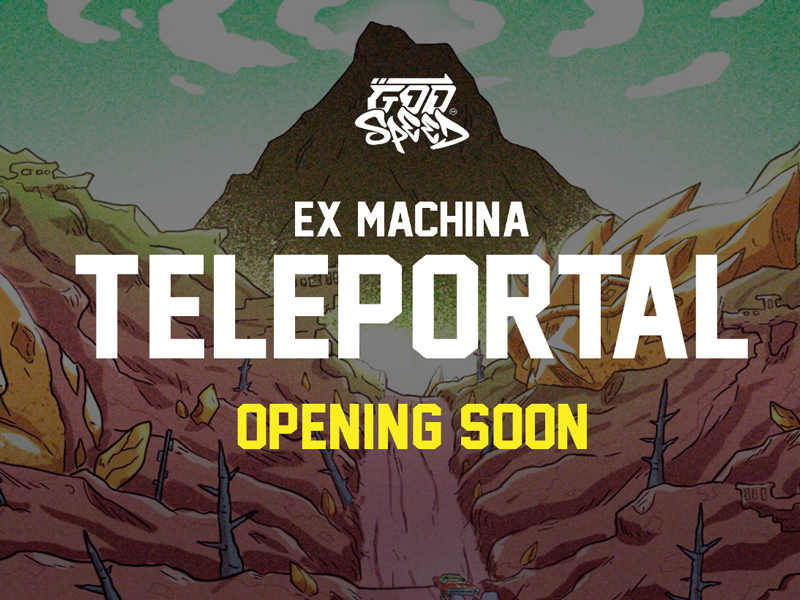

一个存在于以太坊区块链上的故事和社区驱动的 NFT 项目。艺术本身深受流行文化、街头时尚、经典漫画和漫画的影响。888 GENESIS PFP 以编程方式从 350 多个特征中生成，每个特征都有自己的稀有性。Godspeed Metaverse Genesis 是一个 NFT（不可替代令牌）集合。存储在区块链上的数字艺术品集合。

总共有 444 个 Godspeed Metaverse Genesis NFT。目前 237 位所有者的钱包中至少有一个 Godspeed Metaverse Genesis NTF。