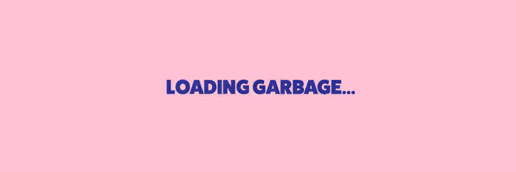

我们是世界 我们是基因 我们是创造美好一天的人，所以让我们开始给予吧 我们正在做出选择 我们正在拯救我们自己的行李 真的，我们会创造更美好的一天，只有你和我

这将在我们的隐形朋友掉落后发生。我们如何对待持有者/公众的抢先体验尚未决定，所以不要为了 EA 广告而将你的一生都投入到制作粉丝艺术上。仍然喜欢粉丝艺术，但你明白了。说了这么多，你想要什么？

我们是世界 我们是基因 我们是创造美好一天的人，所以让我们开始给予吧 我们正在做出选择 我们正在拯救我们自己的行李 真的，我们会创造更美好的一天，只有你和我

