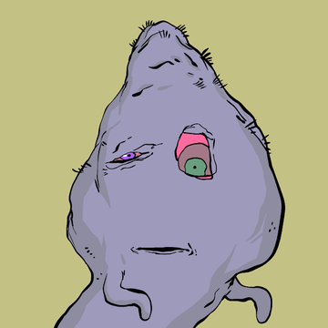

 什么是食尸鬼官方？

Ghoultownwtf Official 是一个 NFT（非同质代币）集合。存储在区块链上的数字艺术品集合。

Ghoultownwtf 官方代币有多少？

总共有 5,000 个 Ghoultownwtf 官方 NFT。目前，377 位所有者的钱包中至少有一个 Ghoultownwtf 官方 NTF。

Ghoultownwtf 官方促销中最贵的一次是什么？

最昂贵的 Ghoultownwtf Official NFT 是 Ghoultownwtf #416。它于 2022-06-06（3 个月前）以 9.1 美元的价格售出。

最近卖出了多少 Ghoultownwtf Official？

过去 30 天内售出了 50 个 Ghoultownwtf 官方 NFT。

 Ghoultownwtf 官员的费用是多少？

过去 30 天，最便宜的 Ghoultownwtf 官方 NFT 销售额低于 1 美元，最高销售额超过 3 美元。在过去 30 天内，Ghoultownwtf 官方 NFT 的价格为 2 美元。

