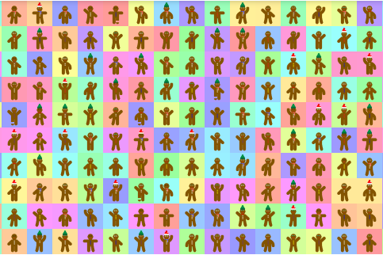

**什么是 GingerBread NFT 收藏？**

GingerBread NFT Collection 是一个 NFT (Non-fungible token) 集合。存储在区块链上的数字艺术品集合。

**有多少 GingerBread NFT Collection 代币？**

总共有 1,000 个 GingerBread NFT Collection NFT。目前，77 位所有者的钱包中至少有一个 GingerBread NFT Collection NTF。

