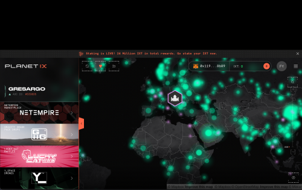
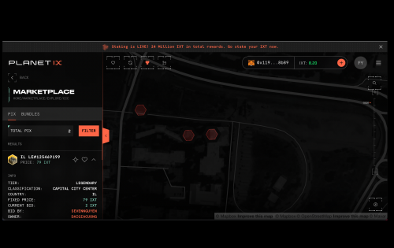
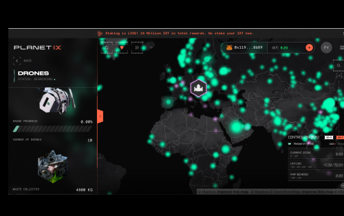

Planet IX 是一款基于 NFT 的 GameFi 策略游戏。将我们星球的虚拟副本作为您的游戏场，您的目标是让地球恢复往日的绿色和蓝色荣耀——您可以通过获取称为 PIX 的土地、收集废物、将其换成奖励并升级您的 PIX 来实现与进一步振兴地球的设施。 

主要游戏目标是收集和交易尽可能多的 PIX，并通过我们的 PlayToEarn 功能恢复地球，例如收集废物。当您以自己的方式交易或合作到更大的 PIX 区域时，您将能够将它们合并到一个 Territory NFT 中，从而实现您的 PIX 收藏的真正和独家所有权。PIX 是使用我们自己的名为 IX Token (IXT) 的 ERC-20 实用代币获得的，该代币于 2021 年 11 月 20 日推出。游戏故事和叙述旨在提高人们对人类对地球环境负面影响的认识，还将融入游戏机制。游戏开发路线图包括玩家可以通过为各自的事业捐赠或贡献 IXT 来直接为 ESG 和其他环境影响组织做出贡献的功能。 

玩家还可以参与来自 IX Token 生态的各种 DeFi 产品；单一 IXT Staking、Territory NFT Staking、来自 DEX 的专用 LP 矿池等等。

Planet IX 成立于 2021 年 7 月，并于同年 11 月 20 日全面上链。该游戏已经拥有一个非常敬业的社区，参与度很高，注册用户超过 50 万。

