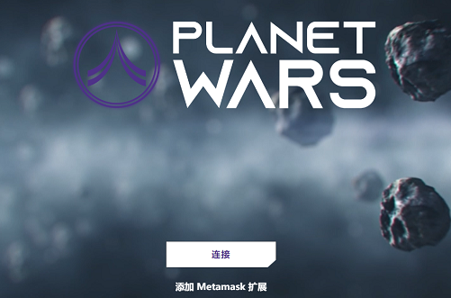

Planet Wars 是一款基于币安智能链，包含 NFT、DeFi 和游戏化概念的太空对战游戏。星球大战星系由 1123 个 NFT 行星组成。他们每个人都有影响游戏奖金的独特特征。星球大战宇宙中存在的资源是三种（金、铁和氢）。每种资源都有不同的代币经济学和功能。宇宙生成并释放资源后，玩家可以在史诗般的个人和部落太空战斗中相互挑战，掠夺其他星球并强化自己的星球。行星、航天器和防御结构是 NFT 代币，可以通过我们 DApp 上的投递系统进行铸造。

