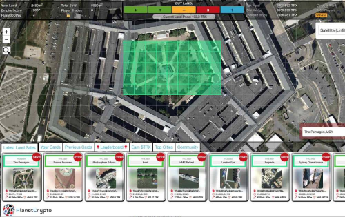
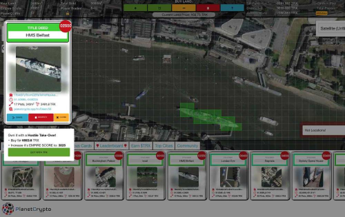

世界上最大的收藏品战略游戏 - 建立您的帝国并赚取 $TRX Planet Crypto 是迄今为止最大的加密收藏品游戏 - 我们将整个全球地图变成了 2000 万平方米的土地，让您可以在地球上的任何地方购买！购买世界著名的地标建筑，如自由女神像、柏林墙、时代广场……或购买您自己的住宅、办公大楼或您家乡的任何部分！您拥有的越多，您的 EMPIRE SCORE 增长就越多，您获得的收益就越多，因为游戏还会向土地持有者支付 $TRX - 建立您的 Empire Score 以在排行榜上名列前茅！

第 1 轮的目标是 LAND GRAB - 收集尽可能多的土地以增加您的 EMPIRE SCORE。

使用屏幕顶部的工具购买土地 - 每张卡最多可以添加 45 块土地...您添加到卡中的土地越多，它变得越有价值，您将获得更多的 EMPIRE SCORE 点数收到！

一旦您购买了土地，它将被添加到您自己的 ERC-721 收藏卡中。这张卡记录了您拥有的土地的详细信息 - 地块（纬度和经度）、它的名称，最重要的是 EMPIRE SCORE。一旦您的新卡被挖掘到区块链，它将显示在桌面页面底部的“您的卡”部分或移动设备的“您的卡”选项卡下。

购买土地会引发土地通胀——每购买一块土地，未来土地价格就会上涨——这就是土地通胀！相反 - 当土地被摧毁时，土地价格开始回落（当然是最低价格！）。

