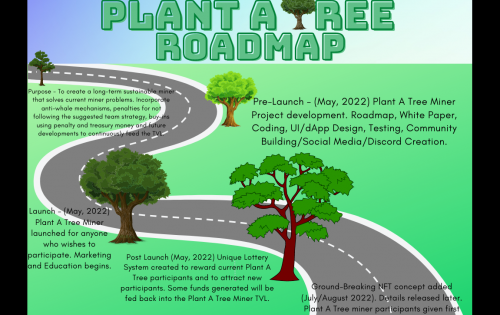
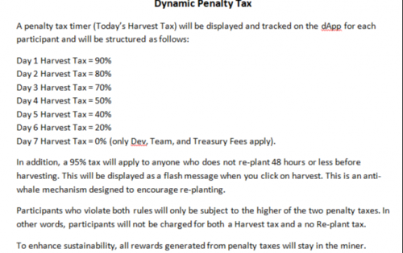
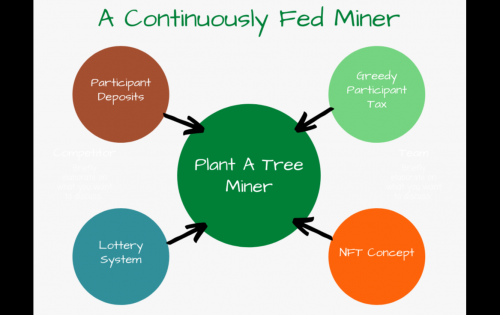

Plant A Tree 项目的目的是创建一个长期可持续的矿工。我们很快意识到，大多数矿工是不可持续的，并且经常使那些违反规则并欺骗系统的人受益。因此，我们开发了一种解决方案，旨在修复损坏的矿工系统，同时仍然提供同样惊人的奖励。Plant A Tree 矿工纳入了反鲸鱼机制，对不遵循建议的团队策略的惩罚，所有惩罚性税收奖励都留在矿工中，以及未来的发展以不断地反馈到矿工合同的 TVL（锁定总价值）中。

