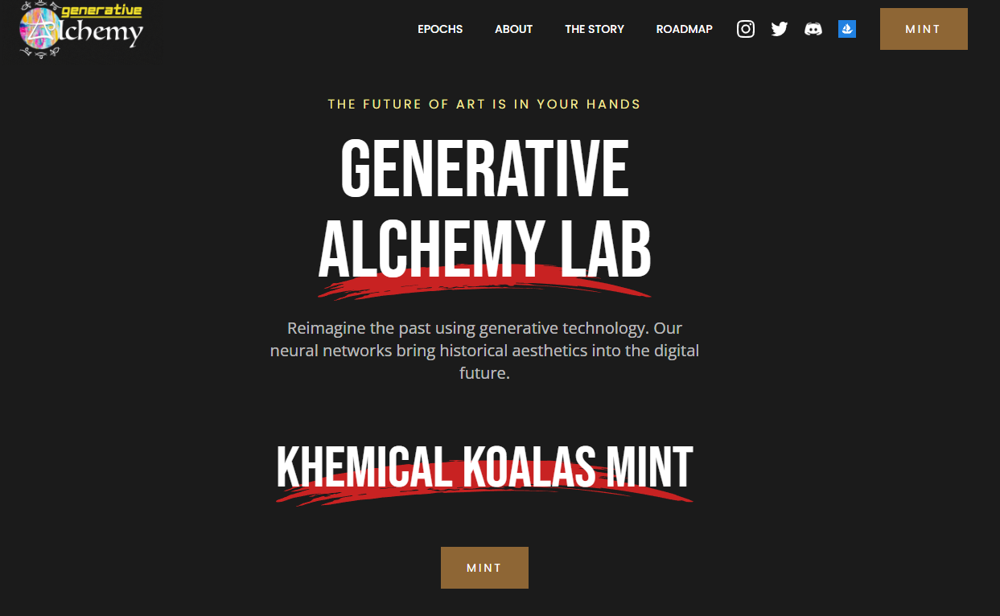

生成炼金术实验室是由三个朋友在元宇宙深处发现的。

通过向创作者、收藏家和流浪者开放实验室——我们希望人们能像我们在数字艺术的创作和收藏中一样找到快乐。

在实验室制作的故事和收藏艺术品中，炼金术士将能够从人类历史上真实的艺术时代中找到风格。

该实验室将帮助您体验一次穿越时空和艺术史的旅程，这将具有启发性和教育意义。

随着我们继续挖掘炼金术实验室的更深部分，我们希望找到更多的宝藏和工具来使用，这将赋予我们的炼金术士更多的创造和表达能力。

