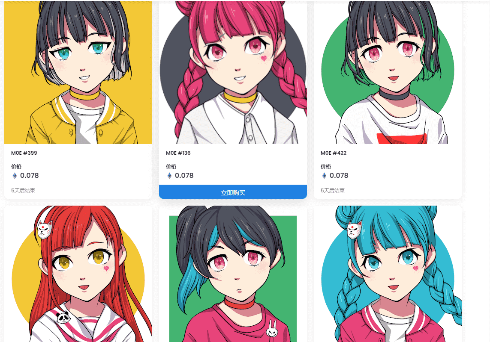

从计划到发布到创作这部作品只用了三周时间。这个团队只有两个人，一个工程师和一个插画师。

受到著名的 NFT 项目的启发，我们开始这个项目是为了“发布可爱角色的可编程插图”。

通过将 MOE 中的 O 替换为零来选择名称 M0E。

这项工作本身没有很好的路线图。但是，我认为这清楚地证明了我们的团队可以在短时间内发布如此高质量的东西。

我们的团队希望成为日本 NFT 运动的重要组成部分，这个项目的收益肯定会帮助我们实现我们想要实现的愿景。

什么是 GenerativeIllust M0E？

GenerativeIllust M0E 是一个 NFT（不可替代令牌）集合。存储在区块链上的数字艺术品集合。

有多少 GenerativeIllust M0E 代币？

总共有 999 个 GenerativeIllust M0E NFT。目前，91 位所有者的钱包中至少有一个 GenerativeIllust M0E NTF。

