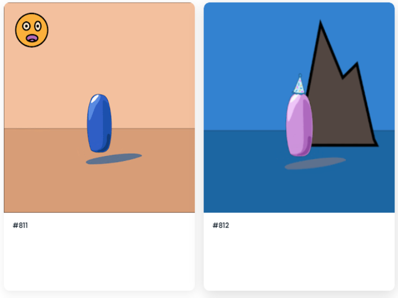

什么是生成艺术？生成艺术是创造艺术的程序化方式。例如在上面的集合中，我有 8 个不同的背景、8 个不同颜色的球、6 个帽子和 6 个风景，使用软件可以创建 2304 个独特的 gif！

问题：当前用于生成艺术的行业标准开源命令行工具（例如[Hashlips 的艺术生成节点）不支持动画图像。像MichaPipo 的 Generative Art Engine这样的分叉项目使用 javascript 图像库，这些库存在以下问题：速度慢，存在像素精度错误和 CPU 使用率。

解决方案：我创建了一个新的生成 gif 引擎命令行工具，它利用著名的 Python 库PIL生成数千个 gif，比其他工具快 10 倍。您可以在一小时内生成一千张 GIF！你所要做的就是：

生成艺术是指全部或部分使用自治系统创作的艺术。在 NFT 空间中，它是指使用软件来获取单个层并根据稀有度生成多种可能的组合。

