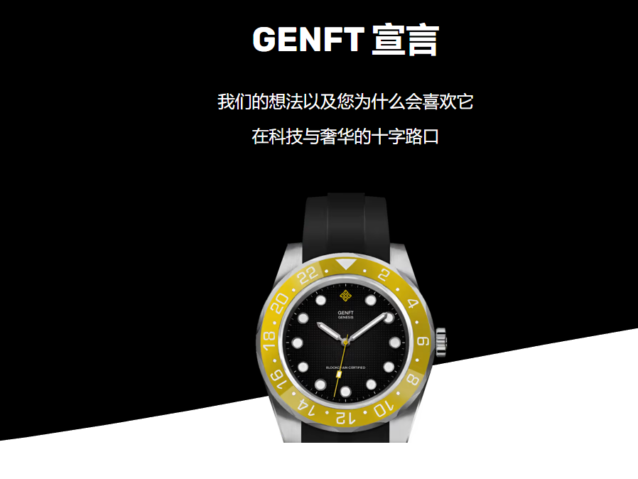

在当今社会，奢侈手表所代表的不仅仅是功能性工具；它们是欲望的对象、地位的象征和价值的持有者。

它们是收藏品。

在 GENFT，我们相信这些数字手表的制造质量与物理手表相同，因此我们将现实生活中的制表支柱应用到 NFT 世界。

两个主要领域变成了数字：信息和零售。

我们从信件变成了电子邮件；从实体报纸到数字网站和社交网络。

就这样，亚马逊、Facebook、谷歌等新巨头来袭，完全超越了传统公司。

今天，我们相信同样的现象会因为区块链技术而发生在奢侈品世界。

举个例子，劳力士不卖手表，爱马仕不卖包包，劳斯莱斯不卖汽车；他们都卖奢侈品。

奢侈品是需求多于提供的时候。奢侈品是稀有和独特的。

奢侈品是你可以吹嘘或存钱的东西。

奢侈品不必是一个特定的对象，甚至更多；它甚至根本不必是一个物理对象。

