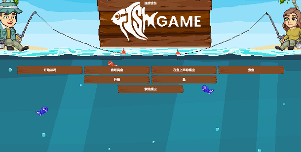

嘿渔夫！我们的团队正在努力在下周之前发布一款没有错误的鱼游戏。一些技术细节可让您了解预期结果

渔夫也可以通过将其令牌 Id 作为参数传递好鱼来烹饪好鱼，从而导致生成特定数量的$FILLET的各种类型的菜肴。但是好鱼NFT就是在这个过程中被烧掉的

什么是鱼游戏 - 官方？

Fish Game - Official 是一个 NFT（不可替代的代币）集合。存储在区块链上的数字艺术品集合。

有多少 Fish Game - 官方代币存在？

总共有 1,600 个 Fish Game - 官方 NFT。目前，686 位所有者的钱包中至少有一款鱼游戏 - 官方 NTF。

什么是最昂贵的鱼游戏 - 官方销售？

最昂贵的 Fish Game - Official NFT 是 Genesis Fisher #633。它于 2022-07-04（大约 2 个月前）以 4.4 美元的价格售出。

