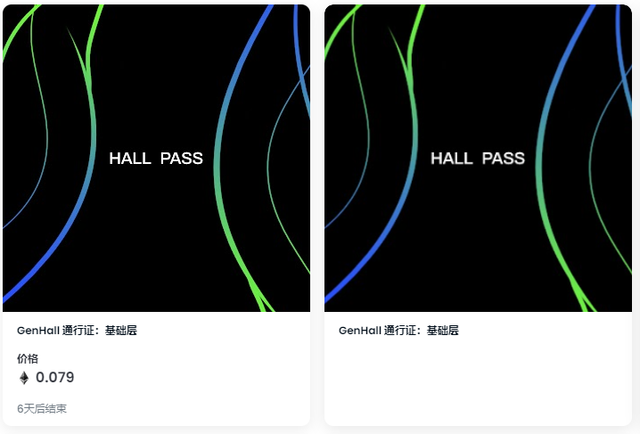

GEN HALL 是数字艺术革命的门户，是发现和探索人工智能和机器想象力潜力的地方。我们从全球各地的艺术家和技术人员那里挑选并为您带来精心制作的生成艺术作品。

什么是 GenHall？

GenHall 是一个 NFT（不可替代令牌）集合。存储在区块链上的数字艺术品集合。

有多少 GenHall 代币？

总共有 2,721 个 GenHall NFT。目前，756 位业主的钱包中至少有一个 GenHall NTF。

GenHall 最近卖出了多少？

过去 30 天内售出 0 个 GenHall NFT。

