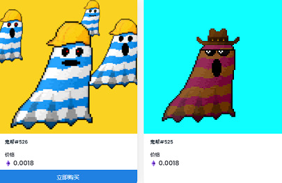

什么是鬼帮 NFT？

Ghost Gang NFT 是一个 NFT（Non-fungible token）集合。存储在区块链上的数字艺术品集合。

鬼帮 NFT 代币有多少？

总共有 1,253 个 Ghost Gang NFT NFT。目前 60 位所有者的钱包中至少有一个 Ghost Gang NFT NTF。

Ghost Gangs 是一个 NFT 集合，包含 5000 个独特的 Ghost Gangs，它们是从超过 1 亿个可能的组合中生成的。

