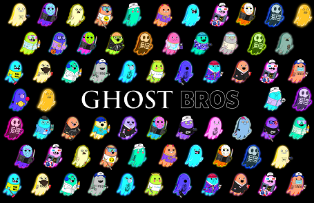

GhostBros 是以太坊区块链上 10,000 个手绘和以编程方式生成的 NFT 的集合。每个 GhostBro 拥有 170 多个特征，都是独一无二的。

GoldBro 喜欢炫耀他的现金，给他铸币，他会给你整个 GhostBro 铸币厂的 1%

Ghost Bros 官方商品商店：薄荷结束后，我们将发布我们的 Ghost Bros 官方商品商店，因此社区成员可以在 Metaverse 内外代表 Ghost Bros 赃物。

社区比赛/赠品：我们将每周至少举办 2 场比赛/赠品，以免费赠送 Ghost Bros，直到薄荷糖结束。

