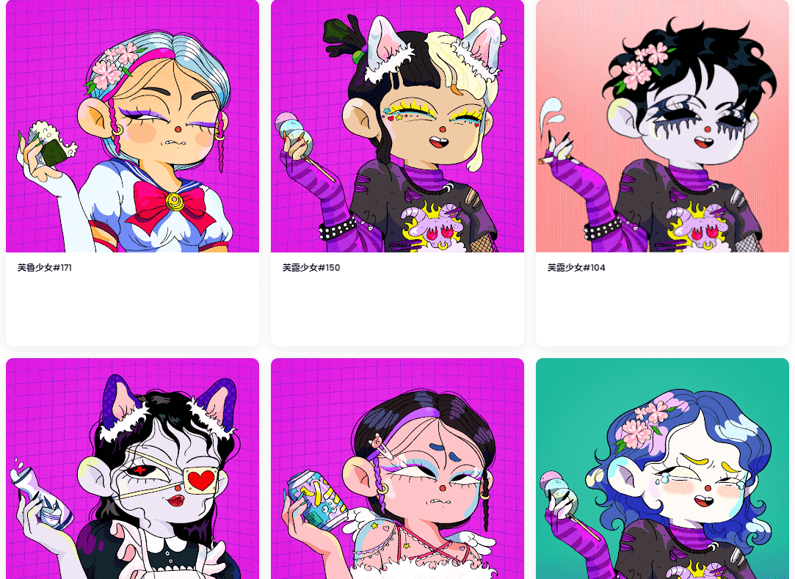

什么是Furu Girls？

Furu Girls 是一个 NFT（不可替代代币）系列。存储在区块链上的数字艺术品集合。

Furu Girls 代币有多少？

总共有 3,500 个 Furu Girls NFT。目前，731 位车主的钱包里至少有一个 Furu Girls NTF。

最近卖了多少Furu Girls？

过去 30 天内售出 5 个 Furu Girls NFT。

我们开始得早一点，因为一些聪明人已经找到了新合同并开始铸造。LFG！

