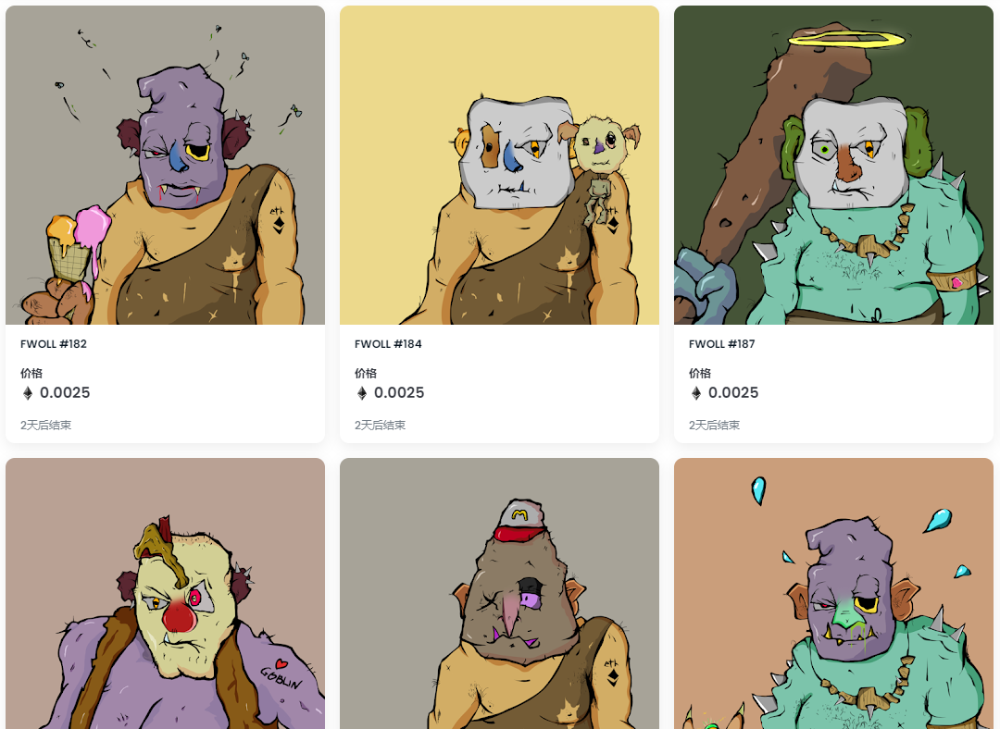

什么是 FwollWTF？

FwollWTF 是一个 NFT（不可替代代币）集合。存储在区块链上的数字艺术品集合。

有多少个 FwollWTF 代币？

总共有 219 个 FwollWTF NFT。目前 27 位所有者的钱包中至少有一个 FwollWTF NTF。

最昂贵的 FwollWTF 销售是什么？

出售的最昂贵的 FwollWTF NFT 是 FWOLL #55。它于 2022-07-02（大约 2 个月前）以 5.5 美元的价格售出。

