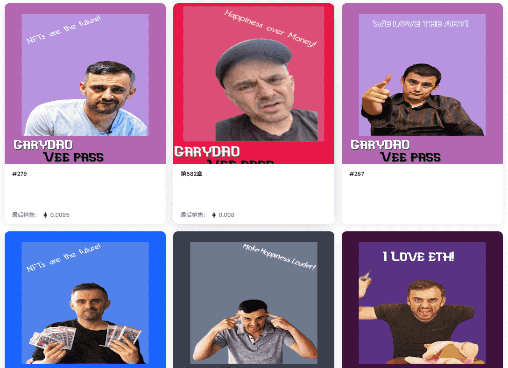

由于我们的 NFT 教父 Gary Vee 的巨大影响，GaryDAO 是 NFT 成为主流的运动。GaryDao 为人民服务，为人民服务，他们真正热爱 Gary Vee，以及他对 NFT 和加密市场的热情。

1111 总供应量 前 900 枚铸币免费 其余铸币成本为 0.01 ETH

什么是 GaryDAO V2？

GaryDAO V2 是一个 NFT（Non-fungible token）集合。存储在区块链上的数字艺术品集合。

有多少个 GaryDAO V2 代币？

总共有 907 个 GaryDAO V2 NFT。目前，102 位所有者的钱包中至少有一个 GaryDAO V2 NTF。

