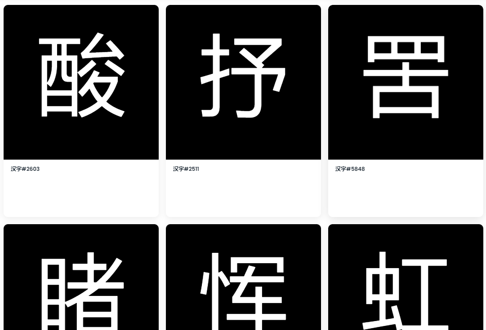

具有四千多年历史的汉字，奠定了世界14亿人口的社会基础。

GB2312-80项目包括GB/T 2312-1980官方字符集中6763个常用汉字（GBK加1个）。在 ERC721 智能合约中，每个字符都被编码为 UTF-8 格式，以便被所有国际通信协议识别。

B/T 2312-1980是中华人民共和国的主要官方字符集，用于简体中文字符。GB2312是EUC-CN的注册互联网名称，是其通常的编码形式。GB指的是国标（国家标准），而T后缀（推荐； tuījiàn； '推荐'）表示非强制性标准。

GB/T 2312-1980原为强制性国家标准，指定为GB 2312-1980。但随着2017年中华人民共和国国家标准公报，GB 2312不再是强制性的，其标准代码修改为GB/T 2312-1980。GB/T 2312-1980已被GBK和GB 18030取代，其中包括附加字符，但GB/T 2312作为这些编码的子集仍然广泛使用。

虽然 GB/T 2312 涵盖了超过 99.99% 的当代中文文本使用，[8]历史文本和许多名称仍然超出范围。旧的GB 2312标准包括 6,763 个汉字（分两个层次：第一个按阅读排列，第二个按部首然后笔画数排列），以及符号和标点、日文假名、希腊字母和西里尔字母、注音和双字节的拼音字母集，带有声调标记。在后来的GB/T 2312-1980中，有7445个字母。

GB/T 2312中的字符排列成94×94的网格，每个字符的两字节码点用kuten（，区位）形式表示，它指定一行（ku或 qū，区）和字符在行内的位置（单元格、十或 wèi，位）。例如，字符“外”（意思是：外国）位于第45行第66位，，因此它的kuten代码是45-66。

